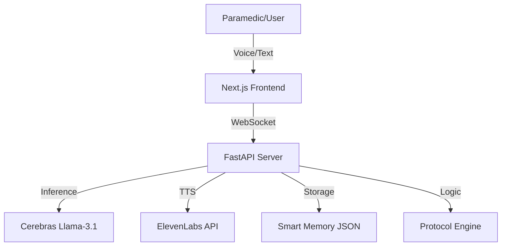

<div align="center">

# 🚑 ResQ-AI
### Smart Ambulance Commander & EMS Triage Assistant

[](https://nextjs.org/)
[](https://fastapi.tiangolo.com/)
[](https://www.python.org/)
[](https://www.typescriptlang.org/)
[](LICENSE)

*Empowering paramedics with real-time AI decision support, automated reporting, and live resource tracking.*

[Features](#-key-features) • [Architecture](#-system-architecture) • [Getting Started](#-installation--setup) • [Contributing](#-contributing)

</div>

---

## 📖 Overview

**ResQ-AI** is a cutting-edge emergency response platform that bridges the gap between field paramedics and hospital command centers. By integrating **Cerebras Llama-3.1-70b** for ultra-low latency medical analysis and **ElevenLabs** for voice alerts, ResQ-AI ensures that critical decisions are data-driven and instantaneous.

## 🚀 Key Features

| Feature | Description |
| :--- | :--- |
| **🧠 AI-Powered Triage** | Real-time symptom analysis and protocol recommendations using **Llama-3.1-70b**. |
| **💊 Safety Guardrails** | Automated drug interaction checks and contraindication warnings. |
| **📋 Instant SBAR** | Generates professional **SBAR** (Situation, Background, Assessment, Recommendation) handoffs instantly. |
| **🗣️ Voice Alerts** | Hands-free safety warnings and protocol reminders via **ElevenLabs**. |
| **🚑 Live Tracking** | Real-time ambulance location and status monitoring on interactive maps. |
| **🏥 Hospital Status** | Live view of nearby hospital bed availability and specialty services. |

## 🏗️ System Architecture



## 🛠️ Tech Stack

### **Frontend**
*   **Framework:** Next.js 14 (App Router)
*   **Styling:** Tailwind CSS + Lucide Icons
*   **Mapping:** React-Leaflet

### **Backend**
*   **Core:** FastAPI (Python)
*   **AI Engine:** Cerebras API (Llama-3.1-70b)
*   **Voice:** ElevenLabs API
*   **Communication:** WebSockets for real-time updates

## 📦 Installation & Setup

### Prerequisites
*   **Node.js** (v18+)
*   **Python** (v3.9+)
*   API Keys: `CEREBRAS_API_KEY`, `ELEVENLABS_API_KEY`

### 1. Clone the Repository
```bash
git clone https://github.com/Ahmed-Islam-AI/ResQ-AI.git
cd ResQ-AI
```

### 2. Backend Setup
```bash
cd backend
python -m venv venv
# Windows: venv\Scripts\activate | Mac/Linux: source venv/bin/activate
pip install fastapi uvicorn python-dotenv httpx pydantic
```
> **Note:** Create a `.env` file in `backend/` with your API keys.

### 3. Frontend Setup
```bash
cd ../frontend
npm install
```

## 🚀 Usage

**Start Backend:**
```bash
# In /backend
python -m uvicorn server:app --reload --port 8000
```

**Start Frontend:**
```bash
# In /frontend
npm run dev
```
Visit `http://localhost:3000` to launch the command center.

## 🤝 Contributing
Contributions are welcome! Please fork the repo and submit a Pull Request.

## 📄 License
Distributed under the MIT License. See `LICENSE` for more information.
