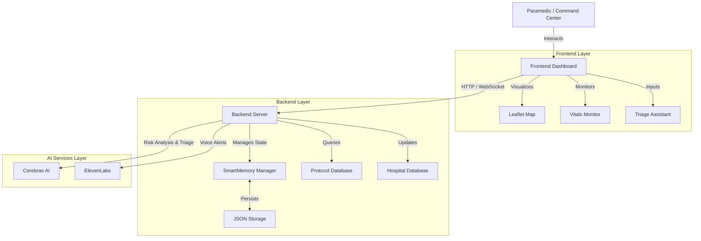

# ResQ-AI: Smart Ambulance Commander & EMS Triage Assistant

**ResQ-AI** is a next-generation mission control system for paramedics. It integrates real-time navigation, patient vital monitoring, AI-powered triage, and hospital resource tracking into a single, unified dashboard. Designed to reduce cognitive load and improve decision-making speed during critical emergencies.

---

## 🏗️ System Architecture

The system follows a modern client-server architecture, leveraging AI services for advanced analysis.



---

## 🚀 Key Features

### 1. **Real-Time Mission Control Dashboard**
   - **Interactive Map:** Live tracking of the ambulance unit and incident location using Leaflet.
   - **Unified View:** All critical information (vitals, map, alerts) is visible at a glance.

### 2. **AI-Powered Smart Triage**
   - **Instant Analysis:** Uses **Cerebras AI** to analyze natural language symptoms (e.g., "chest pain radiating to left arm").
   - **Protocol Matching:** Automatically suggests the correct EMS protocol and Triage Level (ESI).
   - **Risk Assessment:** Identifies life-threatening conditions immediately.

### 3. **Patient Safety & Vitals Monitoring**
   - **Live Vitals:** Simulates real-time streams of Heart Rate, BP, SpO2, and Respiratory Rate.
   - **Safety Guardian:** Automatically checks for drug interactions and contraindications based on patient history.
   - **Audio Alerts:** Uses **ElevenLabs** to generate spoken warnings for critical events.

### 4. **Resource & Hospital Management**
   - **Hospital Tracking:** Displays nearby hospitals with real-time status (Normal, Busy, Diverting) and bed availability.
   - **Inventory System:** Interactive tracking of ambulance supplies (oxygen, meds, kits) with low-stock alerts.

### 5. **AI Voice Assistant**
   - **Natural Language Query:** Paramedics can ask questions via voice or text (e.g., "Protocol for severe burns?").
   - **Multilingual Support:** Capable of understanding and responding in multiple languages (English/Urdu).

---

## 🛠️ Tech Stack

### **Frontend**
-   **Framework:** Next.js 14 (React)
-   **Styling:** Tailwind CSS
-   **Icons:** Lucide React
-   **Maps:** React Leaflet / OpenStreetMap

### **Backend**
-   **Framework:** FastAPI (Python)
-   **State Management:** Custom "SmartMemory" (JSON-based persistence)
-   **AI Integration:** Cerebras API (Llama 3.1-70b)
-   **TTS:** ElevenLabs API

---

## 📦 Installation & Setup

### Prerequisites
-   Node.js & npm
-   Python 3.8+
-   API Keys for Cerebras and ElevenLabs (optional, system has fallbacks)

### 1. Backend Setup
```bash
cd backend
# Create virtual environment (optional)
python -m venv venv
source venv/bin/activate  # or venv\Scripts\activate on Windows

# Install dependencies
pip install fastapi uvicorn httpx python-dotenv pydantic

# Run the server
uvicorn server:app --reload
```
*Server runs on `http://localhost:8000`*

### 2. Frontend Setup
```bash
cd frontend
# Install dependencies
npm install

# Run the development server
npm run dev
```
*Dashboard accessible at `http://localhost:3000`*

---

## 🧪 API Overview

| Method | Endpoint | Description |
| :--- | :--- | :--- |
| `GET` | `/hospitals` | List nearby hospitals and status |
| `POST` | `/analyze` | Analyze transcript for medical risks |
| `POST` | `/protocol/search` | Search EMS protocols by symptom |
| `POST` | `/assistant/ask` | Query the AI assistant |
| `WS` | `/ws/location/{id}` | Real-time location websocket |

---

**ResQ-AI** — *Smarter Response. Safer Future.*
